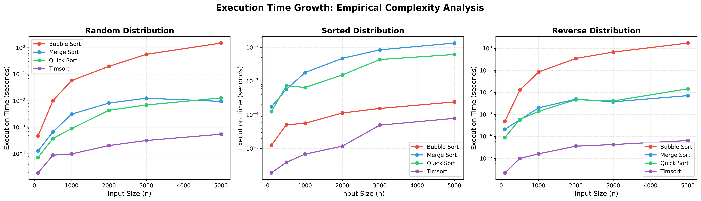
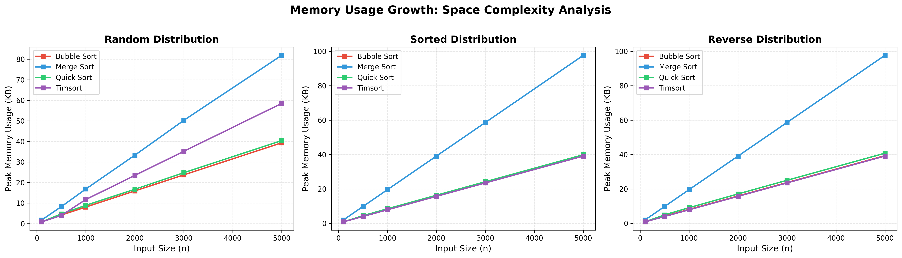

# Benchmarking_of_sorting_algorithms


An empirical study comparing the performance of four sorting algorithms across different input distributions. This project validates theoretical complexity analysis through systematic benchmarking and visualization.

## Overview

This project benchmarks Bubble Sort, Merge Sort, Quick Sort, and Timsort on random, sorted, and reverse-sorted datasets. It measures execution time and memory usage to demonstrate how algorithmic complexity translates to real-world performance.

**Main Goal:** I wanted to test if O(n²) algorithms are really that much slower in practice, or if it's just theoretical.

## Quick Start
Note: First run may take longer depending on the machine. 
```bash
git clone https://github.com/Swnm1/Benchmarking_of_sorting_algorithms.git
cd sorting-algorithm-benchmark
python -m venv venv
Windows: venv\Scripts\activate
pip install -r requirements.txt
python main.py
```

Output files are saved to `plots/` (visualizations) and `results.csv` (raw data).

## Algorithms Tested

**Bubble Sort** - O(n²) baseline implementation with early termination optimization.

**Merge Sort** - Divide-and-conquer algorithm with consistent O(n log n) performance and O(n) space requirement.

**Quick Sort** - Uses median-of-three pivot selection to reduce worst-case probability on sorted inputs.

**Timsort** - Python's built-in sorting algorithm, optimized for real-world data patterns.

## Results

### Time Complexity Analysis



*Figure 1: Execution time across input distributions. Log-scale y-axis reveals quadratic growth for Bubble Sort versus linearithmic growth for other algorithms.*

**Key Findings:**
- Bubble Sort exhibits clear O(n²) scaling, becoming significantly slower beyond 2000 elements
- Merge Sort and Quick Sort show similar O(n log n) performance on random data
- Timsort demonstrates adaptive behavior, performing best on sorted and reverse-sorted inputs
- Median-of-three pivot strategy prevents Quick Sort's O(n²) degradation on sorted data

### Memory Usage Analysis



*Figure 2: Peak memory consumption by algorithm. Bubble Sort's O(1) auxiliary space contrasts with Merge Sort and Timsort's O(n) requirements.*

**Key Findings:**
- Bubble Sort maintains minimal memory footprint (in-place sorting)
- Merge Sort shows linear memory growth due to auxiliary merge arrays
- Quick Sort uses O(log n) space for recursion stack
- Memory measurements include Python interpreter overhead; focus on relative trends

## Methodology

**Experimental Design:**
- 4 algorithms × 3 distributions × 6 input sizes = 72 total experiments
- Input sizes: 100, 500, 1000, 2000, 3000, 5000 elements
- Fixed random seed (42) ensures reproducibility

**Measurement Approach:**
- Time: `time.perf_counter()` for high-precision measurements
- Memory: `tracemalloc` for peak allocation tracking
- Separate runs for time and memory to avoid instrumentation overhead
- Fresh data copies prevent cross-experiment contamination

**Input Distributions:**
- Random: uniformly distributed integers (general case)
- Sorted: ascending order (best/worst-case testing)
- Reverse: descending order (stress testing)

## Project Structure
The codebase is organized as follows:
```
sorting-algorithm-benchmark/
├── src/
│   ├── algorithms.py      # Four sorting implementations
│   ├── data_utils.py      # Reproducible data generators
│   └── benchmark.py       # Timing and memory profiling
├── plots/                 # Generated visualizations
│   ├── execution_time.png
│   └── memory_usage.png
├── main.py               # Main execution script
├── requirements.txt      # Dependencies (pandas, matplotlib)
└── results.csv          # Raw benchmark data
```

## Key Insights

**Complexity Validation:** Empirical measurements confirm theoretical predictions. Bubble Sort's execution time grows quadratically while O(n log n) algorithms show linearithmic scaling.

**Timsort Optimization:** Python's default sort consistently outperforms academic implementations due to adaptive run detection and optimized merging strategies. On sorted data, it approaches O(n) performance.

**Pivot Strategy Impact:** Median-of-three pivot selection successfully prevents Quick Sort's worst-case behavior on sorted inputs, demonstrating the importance of implementation details.

**Space-Time Tradeoffs:** Merge Sort's O(n) auxiliary space enables guaranteed O(n log n) time, while Bubble Sort's O(1) space comes at the cost of O(n²) time.

## Performance Summary

The benchmarks confirmed theoretical predictions:
- Bubble Sort scales quadratically (O(n²))
- Merge Sort, Quick Sort, and Timsort all show linearithmic growth (O(n log n))
- Quick Sort's median-of-three pivot prevents worst-case degradation on sorted inputs


## Technical Implementation

**Data Isolation:** Each algorithm receives a copy of the input array to ensure independent experiments and prevent state contamination.

**Correctness Verification:** All benchmark runs include validation that output is properly sorted and contains the same elements as input.

**Reproducibility:** Fixed random seed and documented methodology enable result verification.

## Future Extensions

- Additional algorithms (Heap Sort, Radix Sort)
-  Statistical analysis with confidence intervals from multiple trials
- Testing on real-world datasets with varying disorder levels
- Larger input sizes for extended complexity curves


## References
- Angela1c - [CTA Benchmarking](https://www.angela1c.com/projects/cta_benchmarking/)
- Sanay Nesargi - [SortBenchmarker](https://github.com/sanaynesargi/SortBenchmarker)
- mexwell - [Exploring Sorting Algorithms](https://www.kaggle.com/code/mexwell/exploring-sorting-algorithms-in-python/notebook)


## License

MIT License - see LICENSE file for details.

---

**Author:** Swornim Shrestha 
**Created:** January 2026  
